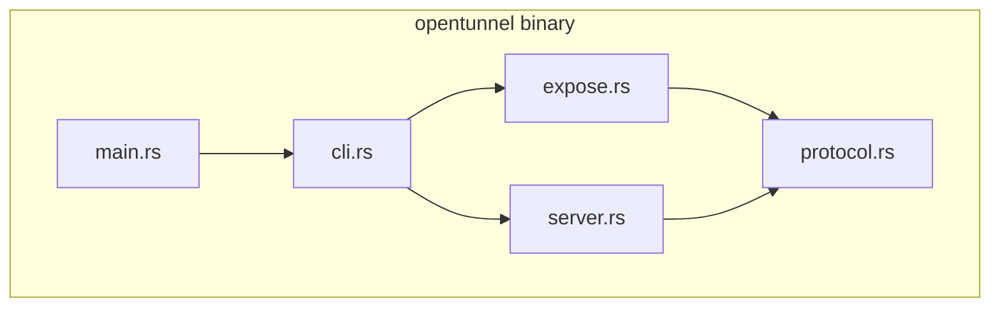
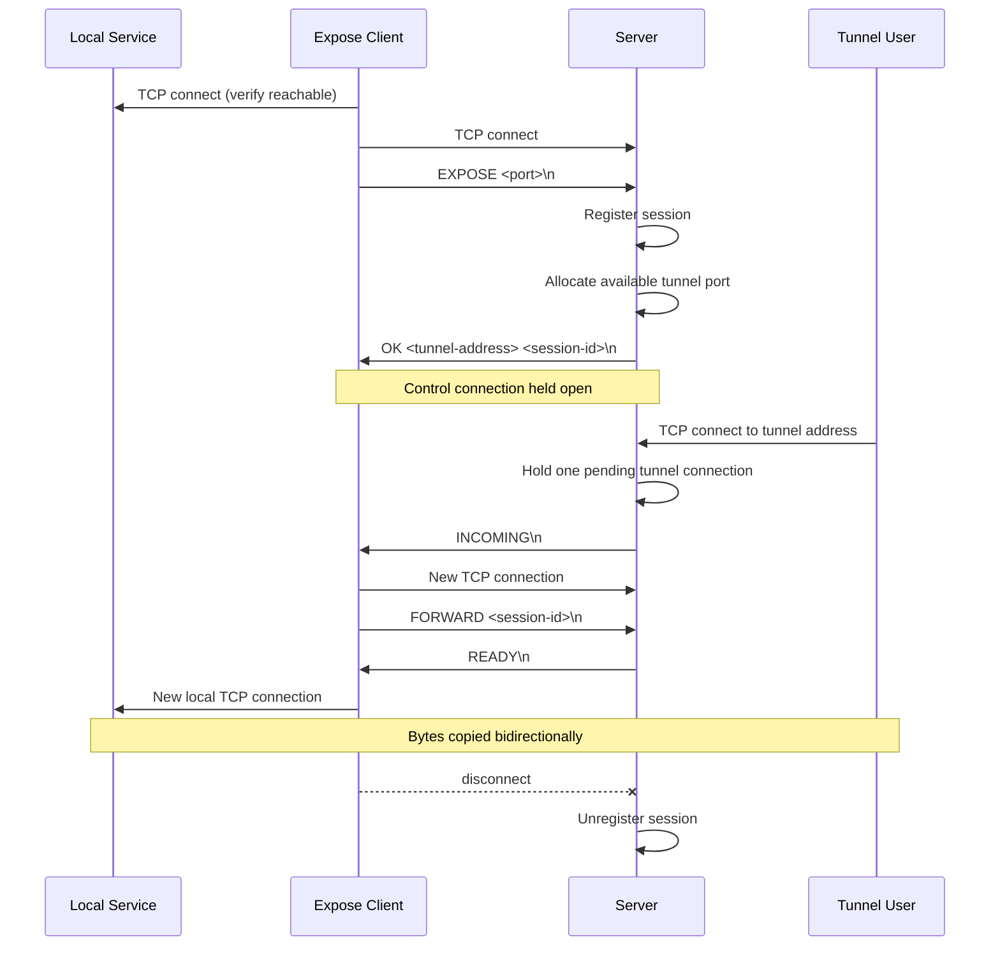

# OpenTunnel

OpenTunnel is an open-source tunneling project written in Rust. The long-term
goal is to provide an ngrok-style workflow for exposing local services through a
public tunnel, while keeping the codebase small enough to learn from.

> Status: early restart. The server command can bind a local TCP listener, and
> the expose command can check whether a local service and an OpenTunnel server
> are reachable. Expose sends a small handshake that the server parses and
> acknowledges. The expose control connection stays open after registration,
> and the server tracks active expose sessions across connection threads. The
> server allocates an independent server-side port for each incoming tunnel.
> Multiple clients can expose services that use the same local port. One
> bidirectional tunnel connection can now be forwarded per expose session.

## Goals

- Expose a local TCP service through a remote public endpoint.
- Keep the protocol and networking code readable.
- Prefer small, reviewable commits over large rewrites.

## Quick Start

Install Rust from <https://rustup.rs/>, then run:

```sh
cd opentunnel
cargo run
```

Expected output:

```text
OpenTunnel

Usage:
  opentunnel --help
  opentunnel --version
  opentunnel server --listen <port>
  opentunnel expose --local <port> --server <address>
```

You can also run:

```sh
cargo run -- --version
cargo run -- server --listen 8080
cargo run -- expose --local 3000 --server 127.0.0.1:8080
```

The server listens on `127.0.0.1` and runs until stopped with `Ctrl-C`.
The expose command expects a service to already be listening on the selected
local port and an OpenTunnel server address such as `127.0.0.1:8080`.
After connecting, expose sends `EXPOSE <local-port>` to the server and expects
`OK <tunnel-address> <session-id>` back. The expose command prints the address
and records the ID that future data connections will use for routing. Rejected
handshakes return `ERR <reason>` so the expose command can report why
registration failed. After `OK`, expose keeps the control connection open until
stopped. The server registers active expose sessions by ID and removes them when
they disconnect. An accepted session reserves the dynamically allocated tunnel
port on the server until the expose disconnects.
Because tunnel ports are allocated independently, different clients may expose
the same local service port without conflicting. The expose command also exits
with an error if the server closes the control connection. Each expose session
accepts one incoming TCP connection while continuing to monitor its control
connection. The server sends `INCOMING` so the expose client opens a separate
connection with `FORWARD <session-id>`. After `READY`, the server pairs the
tunnel user with that forward stream, while the expose client pairs it with a
fresh connection to the local service. Both sides then copy bytes
bidirectionally. Session IDs are currently monotonic routing identifiers, not
authentication credentials.

## Architecture





## Repository Layout

```text
opentunnel/
├── Cargo.toml
└── src/
    ├── cli.rs
    ├── expose.rs
    ├── main.rs
    ├── protocol.rs
    ├── relay.rs
    └── server.rs
```

## Roadmap

1. Project structure.
2. CLI shape.
3. Configuration parsing.
4. Local TCP listener.
5. Tunnel protocol.
6. Client/server connection flow.
7. Public tunnel routing.

## Development

This project intentionally moves in small steps. Early commits may skip tests
when the change is only structure or documentation. Once behavior appears, tests
should be added close to the code that introduces it.
